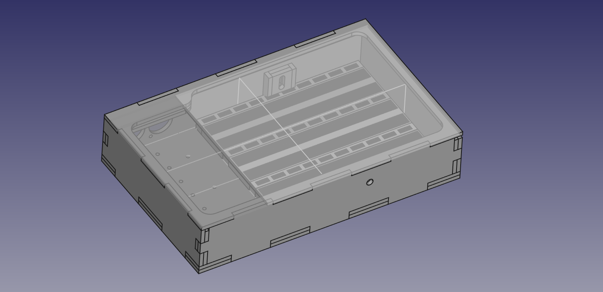

<!--lint disable list-item-indent-->

# BreadBoardBox
a 3D designed / 2D Lasercutter friendly Box-Design for one up to three Breadboards

full step file: [BreadBoardBox.step](BreadBoardBox.step)

all sides are build from two 4mm wood sheets - so wall-thickness is 8mm.
with this its possible that all screw-heads are hidden in the thickness of the outer sheet.

the 3d model is designed in FreeCAD.  
the file is partly 'automated'

all parts needed to be cut are in the export folder.  
for some of the parts there are RDWorks plf files..

after this first do a try fit puzzle. so you know that all is fine..
then you can glue them together.
and finaly sand the box and eventually finish with oil or similar..

## Breadboard measurements:
PR = Power-Rail  
IC = section for chips/parts

- PR-IC-PR
    54mm
- PR-IC-PR-IC-PR
    99,5mm
- PR-IC-PR-IC-PR-IC-PR
    144mm

165mm length
10mm height

---
# License
all Software in this repository is license under MIT License (see [LICENSE file](LICENSE))

all HW / Design files are licensed as CC-BY

<!-- License info -->
 

    LEDBoard_Layout_Sun

by
<a xmlns:cc="http://creativecommons.org/ns#" href="https://github.com/s-light/LEDBoard_Layout_Sun" property="cc:attributionName" rel="cc:attributionURL">
    Stefan Krüger (s-light)
</a>
is licensed under a
<a rel="license" href="http://creativecommons.org/licenses/by/4.0/">
    Creative Commons Attribution 4.0 International License
</a>.
